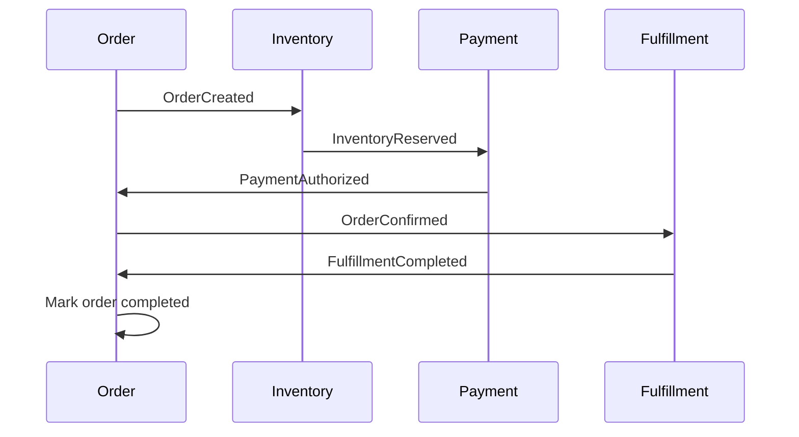

# Consistency Boundaries

## Purpose

This document defines consistency expectations across the commerce event platform.
It explains which operations are transactional, which operations are eventually consistent,
and how services recover from partial failures.

---

## Core Principle

Each service owns its own data and transaction boundary.

The platform does not use distributed transactions across services.

Instead, services communicate through events and use compensation when something fails.

---

## Consistency Model

| Area                                           | Consistency Model    | Reason                                                   |
| ---------------------------------------------- | -------------------- | -------------------------------------------------------- |
| Order creation inside Order Service            | Strong consistency   | Order must be persisted before publishing follow-up work |
| Inventory reservation inside Inventory Service | Strong consistency   | Stock cannot be oversold                                 |
| Payment attempt inside Payment Service         | Strong consistency   | Payment must not be charged twice                        |
| Order + Inventory                              | Eventual consistency | Separate services and databases                          |
| Order + Payment                                | Eventual consistency | Payment result arrives asynchronously                    |
| Order + Fulfillment                            | Eventual consistency | Fulfillment happens after confirmation                   |

---

## Transaction Boundaries

### Order Service

Strongly consistent within:

- order creation
- order status transitions
- order cancellation

Does not transactionally include:

- inventory reservation
- payment authorization
- fulfillment

---

### Inventory Service

Strongly consistent within:

- checking stock availability
- reserving stock
- releasing reserved stock

Does not transactionally include:

- order status updates
- payment authorization

---

### Payment Service

Strongly consistent within:

- payment attempt creation
- idempotency check
- payment status update

Does not transactionally include:

- order confirmation
- inventory release

---

## Eventual Consistency Flows

### Happy Path

