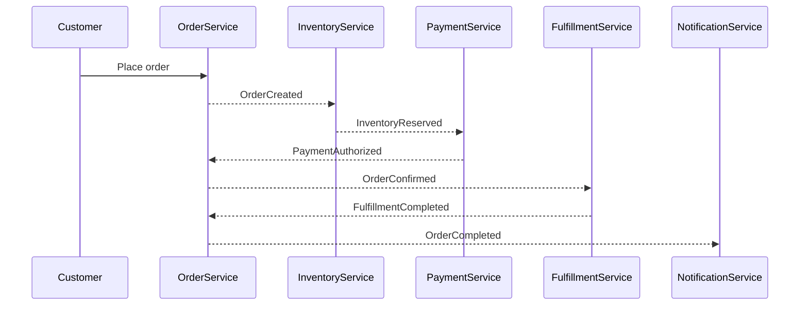

# Service Boundaries

## Purpose

This document defines the initial service boundaries for the commerce event platform.
It explains which service owns each business capability, which data each service controls,
and how services communicate through events.

---

## Boundary Principles

- Each service owns its own data.
- Services do not directly modify another service's database.
- Cross-service communication happens through events.
- Events describe facts that already happened.
- Business decisions should be made by the service that owns the relevant domain concept.

---

## Services Overview

| Service              | Responsibility                   | Owns Data? | Emits Events? |
| -------------------- | -------------------------------- | ---------: | ------------: |
| Order Service        | Creates and manages orders       |        Yes |           Yes |
| Inventory Service    | Reserves and releases stock      |        Yes |           Yes |
| Payment Service      | Authorizes and captures payments |        Yes |           Yes |
| Fulfillment Service  | Prepares and ships orders        |        Yes |           Yes |
| Notification Service | Sends customer notifications     |    Yes[^1] |            No |

[^1]: logs, delivery status

---

## Order Service

### Responsibilities

- Accept new order requests.
- Validate order structure.
- Own the order lifecycle.
- Track current order status.
- React to payment, inventory, and fulfillment events.
- Decide whether an order is confirmed, cancelled, or completed.

### Owns

- Orders
- Order items
- Order status
- Customer-facing order lifecycle

### Does Not Own

- Stock quantity
- Payment authorization result
- Shipment execution
- Email/SMS delivery

### Emits

- `OrderCreated`
- `OrderConfirmed`
- `OrderCancelled`
- `OrderCompleted`

### Consumes

- `InventoryReserved`
- `InventoryReservationFailed`
- `PaymentAuthorized`
- `PaymentFailed`
- `FulfillmentCompleted`
- `FulfillmentFailed`

---

## Inventory Service

### Responsibilities

- Track product stock.
- Reserve inventory for an order.
- Release inventory when an order is cancelled.
- Prevent overselling.

### Owns

- Available stock
- Reserved stock
- Inventory reservations

### Does Not Own

- Order status
- Payment status
- Fulfillment status

### Emits

- `InventoryReserved`
- `InventoryReservationFailed`
- `InventoryReleased`

### Consumes

- `OrderCreated`
- `OrderCancelled`

---

## Payment Service

### Responsibilities

- Process payment authorization.
- Track payment attempts.
- Emit payment result events.
- Avoid duplicate charges.

### Owns

- Payment attempts
- Payment status
- External payment provider references

### Does Not Own

- Order lifecycle
- Inventory reservation
- Shipment process

### Emits

- `PaymentAuthorized`
- `PaymentFailed`
- `PaymentRefunded`

### Consumes

- `InventoryReserved`
- `OrderCancelled`

---

## Fulfillment Service

### Responsibilities

- Start fulfillment after an order is confirmed.
- Track packing/shipping state.
- Emit fulfillment result events.

### Owns

- Fulfillment requests
- Shipment status
- Carrier/tracking reference

### Does Not Own

- Order confirmation decision
- Payment result
- Inventory quantity

### Emits

- `FulfillmentStarted`
- `FulfillmentCompleted`
- `FulfillmentFailed`

### Consumes

- `OrderConfirmed`

---

## Notification Service

### Responsibilities

- Send customer-facing notifications.
- React to lifecycle events.
- Track delivery attempts if needed.

### Owns

- Notification logs
- Delivery status

### Does Not Own

- Order state
- Payment state
- Inventory state

### Emits

- `NotificationSent`
- `NotificationFailed`

### Consumes

- `OrderCreated`
- `OrderConfirmed`
- `OrderCancelled`
- `PaymentFailed`
- `FulfillmentCompleted`

---

## Cross-Service Rules

- Order Service cannot query Inventory Service database directly.
- Payment Service cannot change order status directly.
- Inventory Service cannot decide that an order is confirmed.
- Notification Service cannot trigger business state transitions.
- Services communicate by publishing and consuming domain events.

---

## Initial Service Interaction Flow

